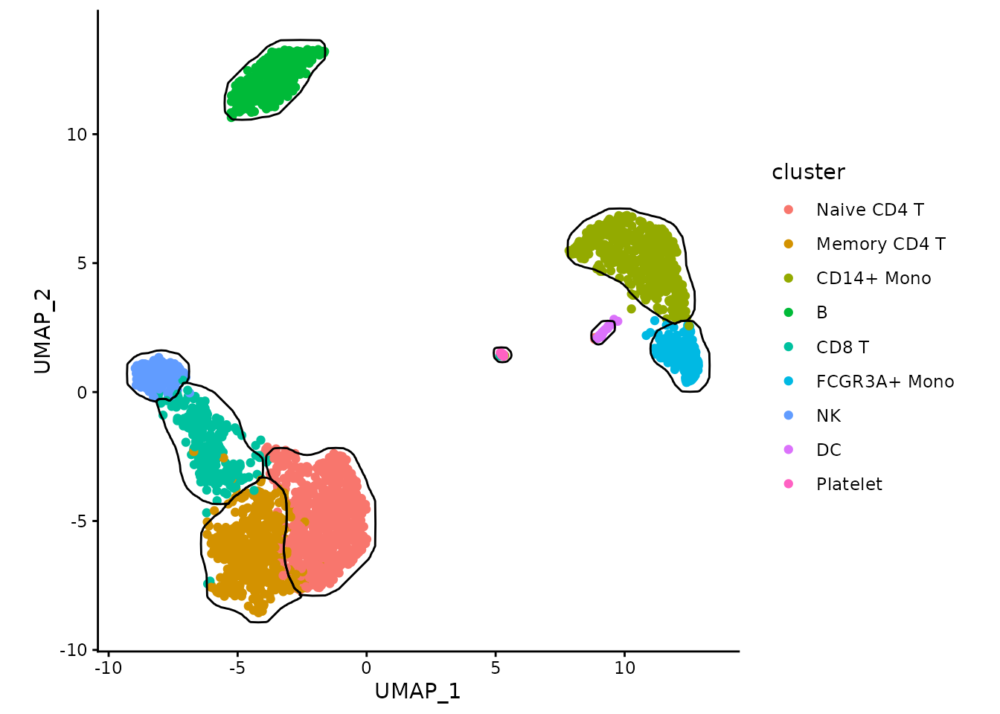
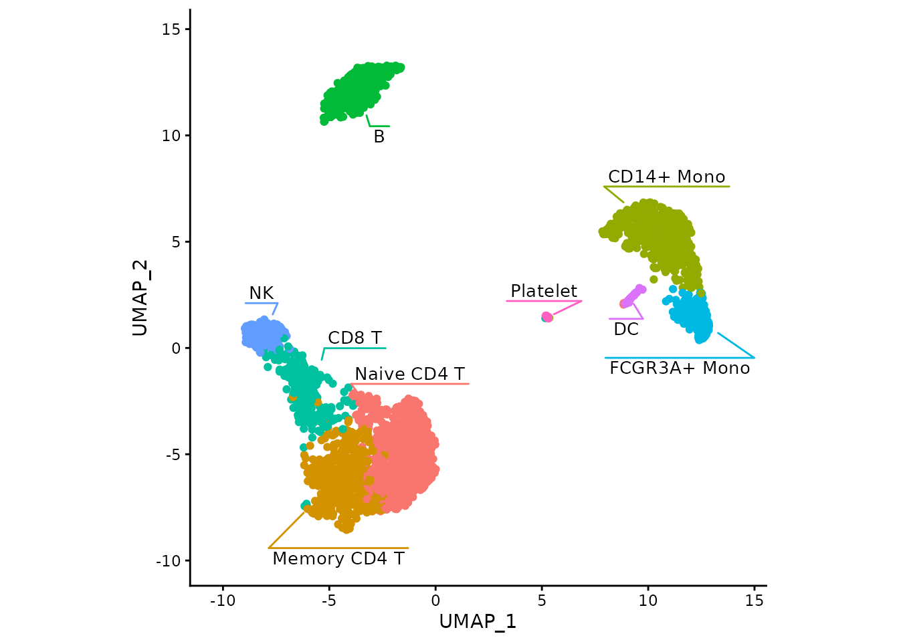
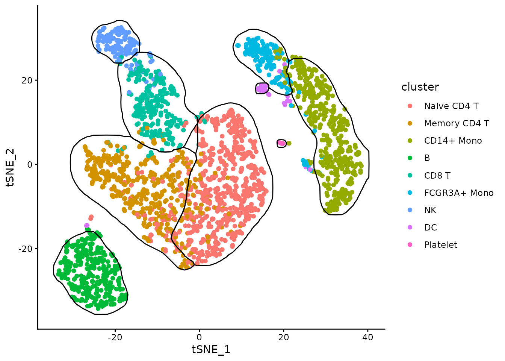
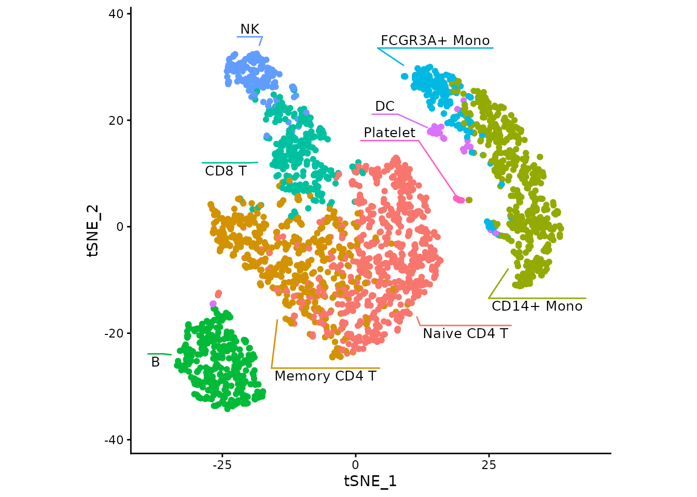
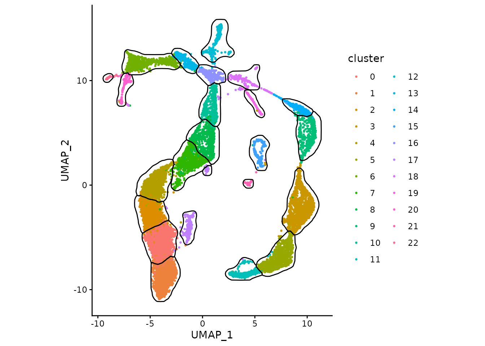
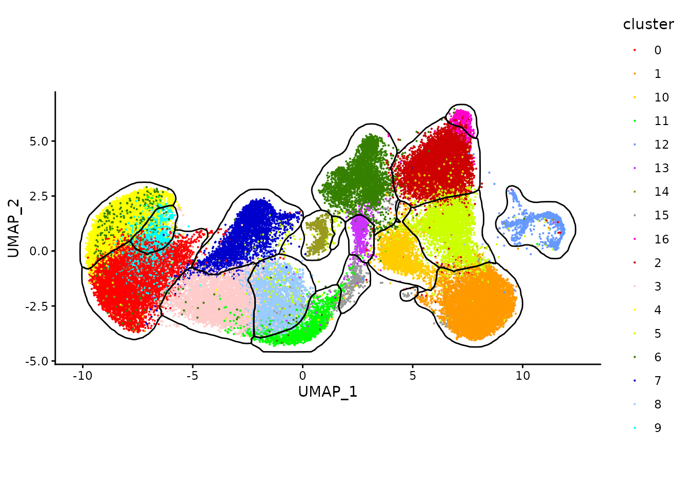
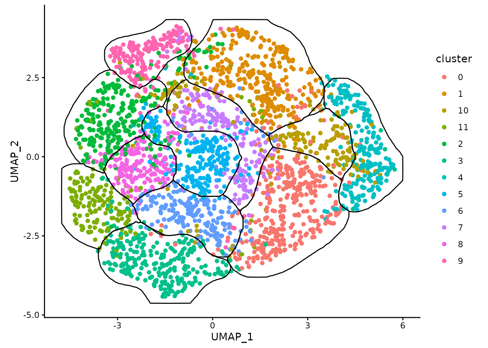
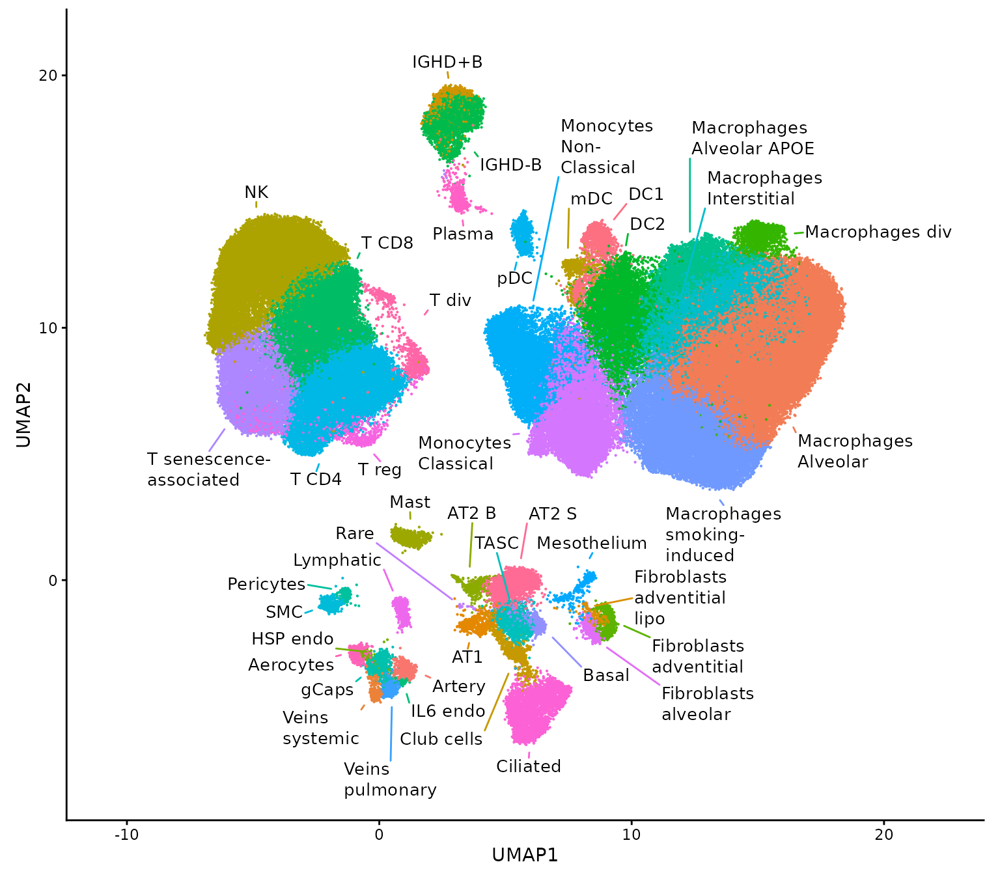

# Gallery of mascarade-generaded masks

### Loading necessary libraries

``` r

library(mascarade)
library(data.table)
library(ggplot2)
library(ggsci)
library(colorrepel)
```

### PBMC-3K UMAP

``` r

example <- readRDS(url("https://alserglab.wustl.edu/files/mascarade/examples/pbmc3k_umap.rds"))
data <- data.table(example$dims, 
                   cluster=example$clusters)

maskTable <- generateMask(dims=example$dims, 
                          clusters=example$clusters)

ggplot(data, aes(x=UMAP_1, y=UMAP_2)) + 
    geom_point(aes(color=cluster)) + 
    geom_path(data=maskTable, aes(group=group)) +
    coord_fixed() + 
    theme_classic()
```



With labels:

``` r

ggplot(data, aes(x=UMAP_1, y=UMAP_2)) + 
    geom_point(aes(color=cluster)) + 
    fancyMask(maskTable, ratio=1, linewidth = 0) +
    theme_classic() + theme(legend.position = "none")
```



### PBMC-3K t-SNE

``` r

example <- readRDS(url("https://alserglab.wustl.edu/files/mascarade/examples/pbmc3k_tsne.rds"))
data <- data.table(example$dims, 
                   cluster=example$clusters)

maskTable <- generateMask(dims=example$dims, 
                          clusters=example$clusters)

ggplot(data, aes(x=tSNE_1, y=tSNE_2)) + 
    geom_point(aes(color=cluster)) + 
    geom_path(data=maskTable, aes(group=group)) +
    coord_fixed() + 
    theme_classic()
```



With labels:

``` r

ggplot(data, aes(x=tSNE_1, y=tSNE_2)) + 
    geom_point(aes(color=cluster)) + 
    fancyMask(maskTable, ratio=1, linewidth = 0) +
    theme_classic() + theme(legend.position = "none")
```



### Aya

``` r

example <- readRDS(url("https://alserglab.wustl.edu/files/mascarade/examples/aya.rds"))
data <- data.table(example$dims, 
                   cluster=example$clusters)

maskTable <- generateMask(dims=example$dims, 
                          clusters=example$clusters)

ggplot(data, aes(x=UMAP_1, y=UMAP_2)) + 
    geom_point(aes(color=cluster), size=0.5) + 
    geom_path(data=maskTable, aes(group=group)) +
    coord_fixed() + 
    theme_classic()
```



### Chia-Jung

``` r

example <- readRDS(url("https://alserglab.wustl.edu/files/mascarade/examples/chiajung1.rds"))
data <- data.table(example$dims, 
                   cluster=example$clusters)

maskTable <- generateMask(dims=example$dims, 
                          clusters=example$clusters)

ggplot(data, aes(x=UMAP_1, y=UMAP_2)) + 
    geom_point(aes(color=cluster), size=0.1) + 
    scale_color_ucscgb() +
    geom_path(data=maskTable, aes(group=group)) +
    coord_fixed() + 
    theme_classic()
```



``` r

example <- readRDS(url("https://alserglab.wustl.edu/files/mascarade/examples/chiajung2.rds"))
data <- data.table(example$dims, 
                   cluster=example$clusters)

maskTable <- generateMask(dims=example$dims, 
                          clusters=example$clusters)

ggplot(data, aes(x=UMAP_1, y=UMAP_2)) + 
    geom_point(aes(color=cluster)) + 
    geom_path(data=maskTable, aes(group=group)) +
    coord_fixed() + 
    theme_classic()
```



### Vladimir Shitov

``` r

example <- readRDS(url("https://alserglab.wustl.edu/files/mascarade/examples/vshitov.rds"))
data <- data.table(example$dims, 
                   cluster=example$clusters)

maskTable <- generateMask(dims=example$dims, 
                          clusters=example$clusters)

ggplot(data, aes(x=UMAP1, y=UMAP2)) + 
    geom_point(aes(color=cluster), size=0.1) + 
    scale_color_repel() +
    fancyMask(maskTable, 
              con.type = "line",
              ratio=1, 
              linewidth = 0, 
              limits.expand = c(0.2, 0.1),
              label.buffer = unit(1, "mm"),
              label.width = unit(20, "mm"),
              label.margin = margin(1, 1, 1, 1, "pt"),
              label.fontsize = 10) +
    theme_classic() + theme(legend.position = "none")
```



### Session info

``` r

sessionInfo()
```

    ## R version 4.6.1 (2026-06-24)
    ## Platform: x86_64-pc-linux-gnu
    ## Running under: Ubuntu 24.04.4 LTS
    ## 
    ## Matrix products: default
    ## BLAS:   /usr/lib/x86_64-linux-gnu/openblas-pthread/libblas.so.3 
    ## LAPACK: /usr/lib/x86_64-linux-gnu/openblas-pthread/libopenblasp-r0.3.26.so;  LAPACK version 3.12.0
    ## 
    ## locale:
    ##  [1] LC_CTYPE=C.UTF-8       LC_NUMERIC=C           LC_TIME=C.UTF-8       
    ##  [4] LC_COLLATE=C.UTF-8     LC_MONETARY=C.UTF-8    LC_MESSAGES=C.UTF-8   
    ##  [7] LC_PAPER=C.UTF-8       LC_NAME=C              LC_ADDRESS=C          
    ## [10] LC_TELEPHONE=C         LC_MEASUREMENT=C.UTF-8 LC_IDENTIFICATION=C   
    ## 
    ## time zone: UTC
    ## tzcode source: system (glibc)
    ## 
    ## attached base packages:
    ## [1] stats     graphics  grDevices utils     datasets  methods   base     
    ## 
    ## other attached packages:
    ## [1] colorrepel_0.5.0  ggsci_5.1.0       ggplot2_4.0.3     data.table_1.18.4
    ## [5] mascarade_0.4.0  
    ## 
    ## loaded via a namespace (and not attached):
    ##  [1] gtable_0.3.6           xfun_0.60              bslib_0.11.0          
    ##  [4] htmlwidgets_1.6.4      spatstat.sparse_3.2-0  lattice_0.22-9        
    ##  [7] vctrs_0.7.3            tools_4.6.1            spatstat.utils_3.2-4  
    ## [10] generics_0.1.4         goftest_1.2-3          tibble_3.3.1          
    ## [13] pkgconfig_2.0.3        Matrix_1.7-5           RColorBrewer_1.1-3    
    ## [16] polylabelr_1.0.0       S7_0.2.2               desc_1.4.3            
    ## [19] dqrng_0.4.1            lifecycle_1.0.5        compiler_4.6.1        
    ## [22] farver_2.1.2           deldir_2.0-4           textshaping_1.0.5     
    ## [25] ggforce_0.5.0          spatstat.explore_3.8-1 htmltools_0.5.9       
    ## [28] sass_0.4.10            yaml_2.3.12            pillar_1.11.1         
    ## [31] pkgdown_2.2.1          jquerylib_0.1.4        MASS_7.3-65           
    ## [34] cachem_1.1.0           spatstat.univar_3.2-0  abind_1.4-8           
    ## [37] nlme_3.1-169           spatstat.geom_3.8-1    gtools_3.9.5          
    ## [40] tidyselect_1.2.1       digest_0.6.39          dplyr_1.2.1           
    ## [43] purrr_1.2.2            labeling_0.4.3         distances_0.1.13      
    ## [46] polyclip_1.10-7        fastmap_1.2.0          grid_4.6.1            
    ## [49] cli_3.6.6              magrittr_2.0.5         spatstat.data_3.1-9   
    ## [52] withr_3.0.3            tensor_1.5.1           scales_1.4.0          
    ## [55] rmarkdown_2.31         matrixStats_1.5.0      otel_0.2.0            
    ## [58] ragg_1.5.2             evaluate_1.0.5         knitr_1.51            
    ## [61] rlang_1.3.0            Rcpp_1.1.2             spatstat.random_3.5-0 
    ## [64] glue_1.8.1             tweenr_2.0.3           jsonlite_2.0.0        
    ## [67] R6_2.6.1               systemfonts_1.3.2      fs_2.1.0
