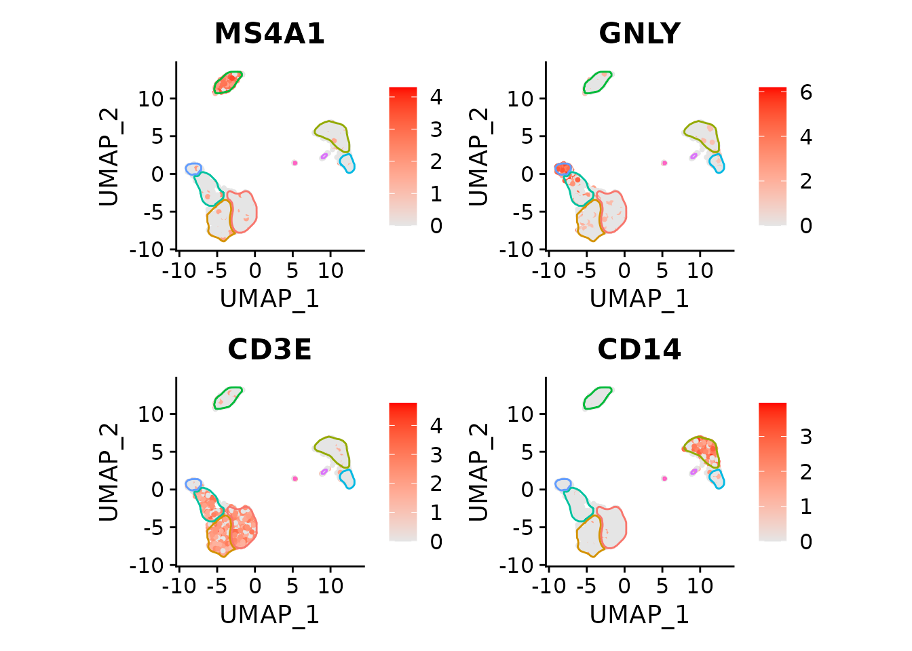

# Using mascarade package

This is a vignette describing usage of `mascarade` to generate masks for
clusters on 2D dimensional reduction plots like UMAP or t-SNE.

### Package installation

The most recent version of the package can be installed from GitHub:

``` r
remotes::install_github("alserglab/mascarade")
```

### Loading necessary libraries

``` r
library(mascarade)
library(data.table)
library(ggplot2)
library(ggforce)
```

### Example run

Loading example data from PBMC 3K processed with Seurat (see below for
more details).

``` r
data("exampleMascarade")
```

UMAP coordinates:

``` r
head(exampleMascarade$dims)
```

    ##                   UMAP_1    UMAP_2
    ## AAACATACAACCAC -4.232792 -4.152139
    ## AAACATTGAGCTAC -4.892886 10.985685
    ## AAACATTGATCAGC -5.508639 -7.211088
    ## AAACCGTGCTTCCG 11.332233  3.161727
    ## AAACCGTGTATGCG -7.450703  1.092022
    ## AAACGCACTGGTAC -3.509504 -6.087042

Cluster annotations:

``` r
head(exampleMascarade$clusters)
```

    ## AAACATACAACCAC AAACATTGAGCTAC AAACATTGATCAGC AAACCGTGCTTCCG AAACCGTGTATGCG 
    ##   Memory CD4 T              B   Memory CD4 T     CD14+ Mono             NK 
    ## AAACGCACTGGTAC 
    ##   Memory CD4 T 
    ## 9 Levels: Naive CD4 T Memory CD4 T CD14+ Mono B CD8 T FCGR3A+ Mono NK ... Platelet

Expression table for several genes:

``` r
head(exampleMascarade$features)
```

    ##                     MS4A1       GNLY       CD3E      CD14     FCER1A     FCGR3A
    ## AAACATACAACCAC -0.4110536 -0.4081782  1.0157094 -0.393789 -0.1373491 -0.4507969
    ## AAACATTGAGCTAC  2.5965712 -0.4081782 -0.9189074 -0.393789 -0.1373491 -0.4507969
    ## AAACATTGATCAGC -0.4110536  0.7526607  0.8148764 -0.393789 -0.1373491 -0.4507969
    ## AAACCGTGCTTCCG -0.4110536 -0.4081782 -0.9189074 -0.393789 -0.1373491  1.1300704
    ## AAACCGTGTATGCG -0.4110536  2.3958265 -0.9189074 -0.393789 -0.1373491 -0.4507969
    ## AAACGCACTGGTAC -0.4110536 -0.4081782  1.1029222 -0.393789 -0.1373491 -0.4507969
    ##                        LYZ       PPBP       CD8A
    ## AAACATACAACCAC -0.11104505 -0.1416271  2.1039769
    ## AAACATTGAGCTAC  0.06112027 -0.1416271 -0.3537211
    ## AAACATTGATCAGC  0.07833934 -0.1416271 -0.3537211
    ## AAACCGTGCTTCCG  1.40875149  2.9255239 -0.3537211
    ## AAACCGTGTATGCG -0.97272094 -0.1416271 -0.3537211
    ## AAACGCACTGGTAC -0.06309661 -0.1416271 -0.3537211

Let’s plot these data:

``` r
data <- data.table(exampleMascarade$dims, 
                   cluster=exampleMascarade$clusters,
                   exampleMascarade$features)
ggplot(data, aes(x=UMAP_1, y=UMAP_2)) + 
    geom_point(aes(color=cluster)) + 
    coord_fixed() + 
    theme_classic()
```


Now let’s generate cluster masks:

``` r
maskTable <- generateMask(dims=exampleMascarade$dims, 
                          clusters=exampleMascarade$clusters)
```

The `maskTable` is actually a table of cluster borders. A single cluster
can have multiple connected parts, and one a single part can contain
multiple border lines (groups).

``` r
head(maskTable)
```

    ##       UMAP_1    UMAP_2           part            group      cluster
    ##        <num>     <num>         <char>           <char>       <fctr>
    ## 1: -3.980324 -9.021239 Memory CD4 T#1 Memory CD4 T#1#1 Memory CD4 T
    ## 2: -3.945936 -9.009776 Memory CD4 T#1 Memory CD4 T#1#1 Memory CD4 T
    ## 3: -3.934473 -8.998313 Memory CD4 T#1 Memory CD4 T#1#1 Memory CD4 T
    ## 4: -3.923011 -8.986850 Memory CD4 T#1 Memory CD4 T#1#1 Memory CD4 T
    ## 5: -3.911548 -8.975387 Memory CD4 T#1 Memory CD4 T#1#1 Memory CD4 T
    ## 6: -3.900085 -8.963925 Memory CD4 T#1 Memory CD4 T#1#1 Memory CD4 T

Now we can use this table to draw the borders with `geom_path` (`group`
column should be used as the group aesthetics):

``` r
ggplot(data, aes(x=UMAP_1, y=UMAP_2)) + 
    geom_point(aes(color=cluster)) + 
    geom_path(data=maskTable, aes(group=group)) +
    coord_fixed() + 
    theme_classic()
```


Or we can color the borders instead of points:

``` r
ggplot(data, aes(x=UMAP_1, y=UMAP_2)) + 
    geom_point(color="grey") + 
    geom_path(data=maskTable, aes(group=group, color=cluster), linewidth=1) +
    coord_fixed() + 
    theme_classic()
```


We can use `ggforce` package to make the borders touch instead of
overlap:

``` r
ggplot(data, aes(x=UMAP_1, y=UMAP_2)) + 
    geom_point(color="grey") + 
    ggforce::geom_shape(data=maskTable, aes(group=group, color=cluster),
                        linewidth=1, fill=NA, expand=unit(-1, "pt")) +
    coord_fixed() + 
    theme_classic()
```


In the presence of small clusters it can help to expand the borders a
bit further away from the points.

``` r
maskTable <- generateMask(dims=exampleMascarade$dims, 
                          clusters=exampleMascarade$clusters,
                          expand=0.02)
ggplot(data, aes(x=UMAP_1, y=UMAP_2)) + 
    geom_point(color="grey") + 
    ggforce::geom_shape(data=maskTable, aes(group=group, color=cluster),
                        linewidth=1, fill=NA, expand=unit(-1, "pt")) +
    coord_fixed() + 
    theme_classic()
```


With the help of `ggforce`-based function `geom_mark_shape` we can also
put the labels within the plot itself.

``` r
myMask <- list(
    geom_mark_shape(data=maskTable, aes(group=cluster, color=cluster, label = cluster),
                    fill = NA,
                   linewidth=1, expand=unit(-1, "pt"),
                   con.cap=0, con.type = "straight",
                   label.fontsize = 10, label.buffer = unit(0, "cm"),
                   label.fontface = "plain",
                   label.minwidth = 0,
                   label.margin = margin(2, 2, 2, 2, "pt"),
                   label.lineheight = 0,
                   con.colour = "inherit",
                   show.legend = FALSE),
    # expanding to give a bit more space for labels
    scale_x_continuous(expand = expansion(mult = 0.1)),
    scale_y_continuous(expand = expansion(mult = 0.1))
)

ggplot(data, aes(x=UMAP_1, y=UMAP_2)) +
    geom_point(color="grey") +
    myMask +
    coord_fixed() +
    theme_classic()
```


The same can be achived with the
[`fancyMask()`](https://alserglab.github.io/mascarade/reference/fancyMask.md)
helper function:

``` r
ggplot(data, aes(x=UMAP_1, y=UMAP_2)) +
    geom_point(color="grey") +
    fancyMask(maskTable, ratio=1) +
    theme_classic()
```


Now we can easily show association between cell types and expression of
particular genes, such as GNLY being a good marker for NK cells in this
dataset.

``` r
ggplot(data, aes(x=UMAP_1, y=UMAP_2)) + 
    geom_point(aes(color=GNLY), size=0.5) +
    scale_color_gradient2(low = "#404040", high="red") + 
    fancyMask(maskTable, ratio=1) +
    theme_classic()
```


We can focus on a single cluster too:

``` r
ggplot(data, aes(x=UMAP_1, y=UMAP_2)) + 
    geom_point(aes(color=GNLY), size=0.5) + 
    scale_color_gradient2(low = "#404040", high="red") + 
    geom_path(data=maskTable[cluster=="NK"], aes(group=group)) +
    coord_fixed() + 
    theme_classic()
```


### Working with Seurat

For this part of the vignette you need `Seurat`package.

``` r
library(Seurat)
```

Let’s get the example PBMC3K dataset:

``` r
pbmc3k <- readRDS(url("https://alserglab.wustl.edu/files/mascarade/examples/pbmc3k_seurat5.rds"))
pbmc3k <- NormalizeData(pbmc3k)
pbmc3k
```

    ## An object of class Seurat 
    ## 13714 features across 2638 samples within 1 assay 
    ## Active assay: RNA (13714 features, 2000 variable features)
    ##  2 layers present: counts, data
    ##  2 dimensional reductions calculated: pca, umap

The same object can be obtained using `SeuratData` package (can be
installed with `remotes::install_github('satijalab/seurat-data')`):

``` r
if (requireNamespace("SeuratData")) {
    if (!AvailableData()["pbmc3k", "Installed"]) {
        InstallData("pbmc3k")    
    }
    LoadData("pbmc3k")
    
    pbmc3k <- UpdateSeuratObject(pbmc3k.final)    
    pbmc3k
}
```

Generate masks using a helper function:

``` r
maskTable <- generateMaskSeurat(pbmc3k)
```

We can use
[`fancyMask()`](https://alserglab.github.io/mascarade/reference/fancyMask.md)
now:

``` r
DimPlot(pbmc3k) + NoLegend() +
    fancyMask(maskTable, ratio=1)
```


For the `DimPlot`, the borders can be viewed as redundant and removed:

``` r
DimPlot(pbmc3k) + NoLegend() +
    fancyMask(maskTable, linewidth = 0, ratio=1)
```


Let’s plot an NK cell marker:

``` r
FeaturePlot(pbmc3k, "GNLY", cols=c("grey90", "red")) +
    fancyMask(maskTable, ratio=1)
```


Or multiple markers (skipping the labels to save space):

``` r
featureList <- c("MS4A1", "GNLY", "CD3E", "CD14")
plots <- FeaturePlot(pbmc3k, features=featureList, cols=c("grey90", "red"), combine = FALSE)
plots <- lapply(plots, `+`, fancyMask(maskTable, ratio=1, linewidth=0.5, label=FALSE))
patchwork::wrap_plots(plots)
```



Works with t-SNE too:

``` r
pbmc3k <- RunTSNE(pbmc3k)

maskTable <- generateMaskSeurat(pbmc3k, reduction = "tsne")

plots <- FeaturePlot(pbmc3k, 
                     features=featureList,
                     reduction = "tsne",
                     cols=c("grey90", "red"),
                     combine = FALSE)
plots <- lapply(plots, `+`, fancyMask(maskTable, ratio=1, linewidth=0.5, label=FALSE))

patchwork::wrap_plots(plots)
```


### Session info

``` r
sessionInfo()
```

    ## R version 4.5.2 (2025-10-31)
    ## Platform: x86_64-pc-linux-gnu
    ## Running under: Ubuntu 24.04.3 LTS
    ## 
    ## Matrix products: default
    ## BLAS:   /usr/lib/x86_64-linux-gnu/openblas-pthread/libblas.so.3 
    ## LAPACK: /usr/lib/x86_64-linux-gnu/openblas-pthread/libopenblasp-r0.3.26.so;  LAPACK version 3.12.0
    ## 
    ## locale:
    ##  [1] LC_CTYPE=C.UTF-8       LC_NUMERIC=C           LC_TIME=C.UTF-8       
    ##  [4] LC_COLLATE=C.UTF-8     LC_MONETARY=C.UTF-8    LC_MESSAGES=C.UTF-8   
    ##  [7] LC_PAPER=C.UTF-8       LC_NAME=C              LC_ADDRESS=C          
    ## [10] LC_TELEPHONE=C         LC_MEASUREMENT=C.UTF-8 LC_IDENTIFICATION=C   
    ## 
    ## time zone: UTC
    ## tzcode source: system (glibc)
    ## 
    ## attached base packages:
    ## [1] stats     graphics  grDevices utils     datasets  methods   base     
    ## 
    ## other attached packages:
    ## [1] Seurat_5.4.0       SeuratObject_5.3.0 sp_2.2-0           ggforce_0.5.0     
    ## [5] ggplot2_4.0.1      data.table_1.18.0  mascarade_0.2.999 
    ## 
    ## loaded via a namespace (and not attached):
    ##   [1] pbapply_1.7-4          deldir_2.0-4           gridExtra_2.3         
    ##   [4] rlang_1.1.6            magrittr_2.0.4         RcppAnnoy_0.0.22      
    ##   [7] otel_0.2.0             matrixStats_1.5.0      ggridges_0.5.7        
    ##  [10] compiler_4.5.2         spatstat.geom_3.6-1    reshape2_1.4.5        
    ##  [13] png_0.1-8              systemfonts_1.3.1      vctrs_0.6.5           
    ##  [16] stringr_1.6.0          pkgconfig_2.0.3        fastmap_1.2.0         
    ##  [19] labeling_0.4.3         promises_1.5.0         rmarkdown_2.30        
    ##  [22] ragg_1.5.0             purrr_1.2.0            xfun_0.55             
    ##  [25] cachem_1.1.0           jsonlite_2.0.0         goftest_1.2-3         
    ##  [28] later_1.4.4            spatstat.utils_3.2-0   tweenr_2.0.3          
    ##  [31] irlba_2.3.5.1          parallel_4.5.2         cluster_2.1.8.1       
    ##  [34] R6_2.6.1               ica_1.0-3              stringi_1.8.7         
    ##  [37] bslib_0.9.0            RColorBrewer_1.1-3     spatstat.data_3.1-9   
    ##  [40] reticulate_1.44.1      parallelly_1.46.0      spatstat.univar_3.1-5 
    ##  [43] scattermore_1.2        lmtest_0.9-40          jquerylib_0.1.4       
    ##  [46] Rcpp_1.1.0             knitr_1.51             tensor_1.5.1          
    ##  [49] future.apply_1.20.1    zoo_1.8-15             sctransform_0.4.2     
    ##  [52] httpuv_1.6.16          Matrix_1.7-4           splines_4.5.2         
    ##  [55] igraph_2.2.1           tidyselect_1.2.1       abind_1.4-8           
    ##  [58] yaml_2.3.12            codetools_0.2-20       spatstat.random_3.4-3 
    ##  [61] miniUI_0.1.2           spatstat.explore_3.6-0 listenv_0.10.0        
    ##  [64] plyr_1.8.9             lattice_0.22-7         tibble_3.3.0          
    ##  [67] shiny_1.12.1           withr_3.0.2            S7_0.2.1              
    ##  [70] ROCR_1.0-11            evaluate_1.0.5         Rtsne_0.17            
    ##  [73] future_1.68.0          fastDummies_1.7.5      desc_1.4.3            
    ##  [76] survival_3.8-3         polyclip_1.10-7        fitdistrplus_1.2-4    
    ##  [79] pillar_1.11.1          KernSmooth_2.23-26     plotly_4.11.0         
    ##  [82] generics_0.1.4         RcppHNSW_0.6.0         scales_1.4.0          
    ##  [85] xtable_1.8-4           globals_0.18.0         glue_1.8.0            
    ##  [88] lazyeval_0.2.2         tools_4.5.2            RSpectra_0.16-2       
    ##  [91] RANN_2.6.2             fs_1.6.6               dotCall64_1.2         
    ##  [94] cowplot_1.2.0          grid_4.5.2             tidyr_1.3.2           
    ##  [97] patchwork_1.3.2        nlme_3.1-168           cli_3.6.5             
    ## [100] spatstat.sparse_3.1-0  textshaping_1.0.4      spam_2.11-1           
    ## [103] viridisLite_0.4.2      dplyr_1.1.4            uwot_0.2.4            
    ## [106] gtable_0.3.6           sass_0.4.10            digest_0.6.39         
    ## [109] progressr_0.18.0       ggrepel_0.9.6          htmlwidgets_1.6.4     
    ## [112] farver_2.1.2           htmltools_0.5.9        pkgdown_2.2.0         
    ## [115] lifecycle_1.0.4        httr_1.4.7             mime_0.13             
    ## [118] MASS_7.3-65
